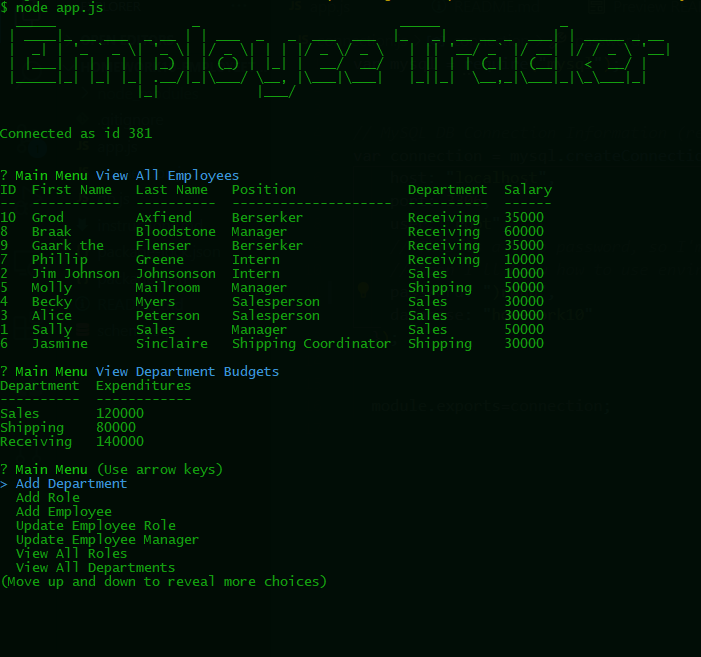

# Employee Manager
[](https://creativecommons.org/licenses/by/4.0/)
## Description
Homework number 10 for Coding Bootcamp. The assignment was to create a command line interface that allowed the user to add departments, roles, and employees to a business. The app connects with a mySQL database for persistant storage, and uses inquirer to prompt the user for input.

## Table of Contents
* [Installation Instructions](#Installation%20Instructions)
* [Usage Instructions](#Usage%20Instructions)
* [Highlights](#Highlights)
* [Demo](#Demo)
* [Screenshot](#Screenshot)
* [Contribution Instructions](#How%20to%20Contribute)
* [License](#License)
* [Questions](#Questions)
## Installation Instructions
1. Set up the database using schema.sql. This includes some initial seed values for departments and roles.
2. In the same directory as package.json, run "``` npm i ```" to install the modules required
3. Make sure that your database password is in connection.js
## Usage Instructions
```node app.js```
## Highlights
Instead of using the inquirer type "input", to ask the user to remember and then type in an ID (e.g., to assign a manager to an employee), I went the extra mile and used "list," which provides the user with a list of possible choices. Holy cats did this add a lot of work for me! Endless chains of functions that call functions. Just today we learned about ORMs in class, and I discovered that that was what I had invented for this homework.

Also, just figuring out the logic and the flow was quite difficult, as many of the user options required multiple database queries. For example, to add a new employee the user must assign them a role and a manager. This meant that I first had to query the db for a list of all possible roles, and when that finished it called a new function to get a list of all possible managers, which then called a third function to prompt the user to input the employee details and choose which role and manager they wanted. This then called a fourth function, to insert the new data in the database. Extremely confusing stuff.

I'm also pretty proud of the sweet triple-JOIN in loadManagers().
## Demo
You can clone the code and follow the installation instructions above. In addition, I've recorded a screencast and me running through it. *NOTE:* the program I was using to capture my screen only had a five minute time limit. I'm *pretty* sure that I managed to demo all of the functionality during that time, but please let me know if anything is missing.

The demo is be available here:
https://drive.google.com/file/d/1KgYbOlzGUVwa1u8eTFdrNVz-hdQMfgvt/view
## Screenshot

## How to Contribute
Contributions are closed at this time.
## License
License: CC BY 4.0
## Questions
Please contact github@sixbynine.com.
Other projects I've worked on are here: https://github.com/B-Dionysus.